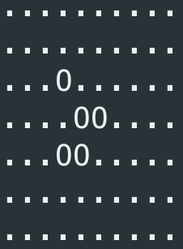

[![Contributors][contributors-shield]][contributors-url]
[![Forks][forks-shield]][forks-url]
[![Stargazers][stars-shield]][stars-url]
[![Issues][issues-shield]][issues-url]
[![MIT License][license-shield]][license-url]
[![LinkedIn][linkedin-shield]][linkedin-url]


<!-- PROJECT LOGO -->
<br />
<p align="center">
  <a href="https://github.com/EthanHolen/game-of-life">
    
  </a>

  <h2 align="center">Game of Life</h2>

  <p align="center">
    Graphical animation of Conways Game of life for homebrew.
    <br />
    <a href="https://github.com/EthanHolen/game-of-life"><strong>Explore the docs »</strong></a>
    <br />
    <br />
    <a href="https://github.com/EthanHolen/game-of-life">View Demo</a>
    ·
    <a href="https://github.com/EthanHolen/game-of-life/issues">Report Bug</a>
    ·
    <a href="https://github.com/EthanHolen/game-of-life/issues">Request Feature</a>
  </p>
</p>


<!-- TABLE OF CONTENTS -->
## Table of Contents

- [Table of Contents](#table-of-contents)
- [About The Project](#about-the-project)
  - [Built With](#built-with)
- [Getting Started](#getting-started)
  - [Prerequisites](#prerequisites)
  - [Installation](#installation)
- [Usage](#usage)
  - [Flags](#flags)
- [Roadmap](#roadmap)
- [Contributing](#contributing)
- [License](#license)
- [Contact](#contact)
- [Acknowledgements](#acknowledgements)

<!-- ABOUT THE PROJECT -->
## About The Project

![Product Name Screen Shot][big-ggg-gif]

### Built With

* [C++](https://www.cplusplus.com)

<!-- GETTING STARTED -->
## Getting Started

To install this on your personal machine follow these steps.

### Prerequisites

* [Homebrew](https://brew.sh/)

1. Go to the [Homebrew](https://brew.sh/) page.
2. Follow the instructions there to install the latest version of homebrew on to your mac.

### Installation

1. After installing homebrew paste this into your terminal

```sh
brew tap EthanHolen/taps
```

1. Then install the software by pasting

```sh
brew install game-of-life
```


<!-- USAGE EXAMPLES -->
## Usage

Once you've gone through the installation process above you can run the command `game-of-life` in your terminal and it should produce this default animation.

![Default Usage][default-gif]

You can exit out of that screen by pressing any key. If you would like to see a different animation you can specify any board as the second argument. I've created a selection of boards that you can get by cloning my [gol-boards](https://github.com/EthanHolen/gol-boards) repo on github. To do that you can go to an empty folder in the terminal and run this command.

```sh
git clone https://github.com/EthanHolen/gol-boards
```

Each of these boards is made up of a series of live and dead characters. For example the default animation has live characters (O), and dead characters (.). These characters follow a few simple rules to create the complex pattern shown in the animation above.

If you would like to know more about Conways game of life you can read more on the [wikipedia](https://en.wikipedia.org/wiki/Conway%27s_Game_of_Life) page. To create your own board you can edit the blank template in [gol-boards](https://github.com/EthanHolen/gol-boards), and checkout the -g flag to specify your own rules for each generation.

### Flags

| Flag | Usage                                                                                                                                                      | Example                    |
| :--- | :--------------------------------------------------------------------------------------------------------------------------------------------------------- | :------------------------- |
| `-t` | Specify the time between generations in seconds (default is 0.2 seconds)                                                                                   | `game-of-life -t 1`        |
| `-g` | Sets a new born and survive rules for each generation. (Default Ex: "B3/S23" a cell is born if it has 3 neighbors and survives if it has 2 or 3 neighbors) | `game-of-life -g "B3/S23"` |
| `-l` | Sets the live character for each generation (Default "O")                                                                                                  | `game-of-life -l "O"`      |
| `-d` | Sets the dead character for each generation (Default ".")                                                                                                  | `game-of-life -d "."`      |


<!-- ROADMAP -->
## Roadmap

See the [open issues](https://github.com/EthanHolen/game-of-life/issues) for a list of proposed features (and known issues).


<!-- CONTRIBUTING -->
## Contributing

Contributions are what make the open source community such an amazing place to be learn, inspire, and create. Any contributions you make are **greatly appreciated**.

1. Fork the Project
2. Create your Feature Branch (`git checkout -b feature/AmazingFeature`)
3. Commit your Changes (`git commit -m 'Add some AmazingFeature'`)
4. Push to the Branch (`git push origin feature/AmazingFeature`)
5. Open a Pull Request


<!-- LICENSE -->
## License

Distributed under the MIT License. See `LICENSE` for more information.

<!-- CONTACT -->
## Contact

Ethan Holen - [@HolenEthan](https://twitter.com/HolenEthan) - ethanholen@gmail.com

Project Link: [https://github.com/EthanHolen/game-of-life](https://github.com/EthanHolen/game-of-life)

<!-- ACKNOWLEDGEMENTS -->
## Acknowledgements

* [Conways Game of Life](https://en.wikipedia.org/wiki/Conway%27s_Game_of_Life)

<!-- MARKDOWN LINKS & IMAGES -->
<!-- https://www.markdownguide.org/basic-syntax/#reference-style-links -->
[contributors-shield]: https://img.shields.io/github/contributors/EthanHolen/game-of-life.svg?style=flat-square
[contributors-url]: https://github.com/EthanHolen/game-of-life/graphs/contributors

[forks-shield]: https://img.shields.io/github/forks/EthanHolen/game-of-life.svg?style=flat-square
[forks-url]: https://github.com/EthanHolen/game-of-life/network/members

[stars-shield]: https://img.shields.io/github/stars/EthanHolen/game-of-life.svg?style=flat-square
[stars-url]: https://github.com/EthanHolen/game-of-life/stargazers

[issues-shield]: https://img.shields.io/github/issues/EthanHolen/game-of-life.svg?style=flat-square
[issues-url]: https://github.com/EthanHolen/game-of-life/issues

[license-shield]: https://img.shields.io/github/license/EthanHolen/game-of-life.svg?style=flat-square
[license-url]: https://github.com/EthanHolen/game-of-life/blob/master/LICENSE

[linkedin-shield]: https://img.shields.io/badge/-LinkedIn-black.svg?style=flat-square&logo=linkedin&colorB=555
[linkedin-url]: https://www.linkedin.com/in/💻-ethan-holen-563856174/

[big-ggg-gif]: rdme-images/big-ggg.gif
[default-gif]: rdme-images/default.gif
